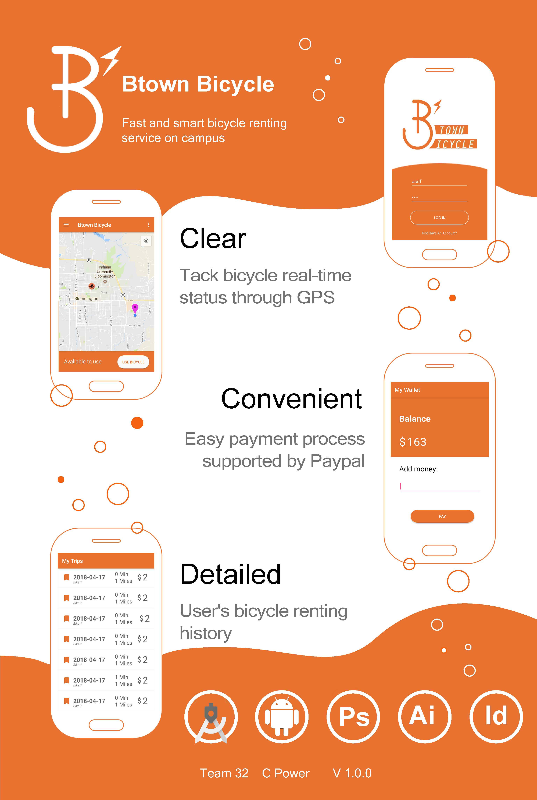

# Project Title Btown Bicycle

    

# Team
- Zhang, Yaokun (Android developer) zhan3393@purdue.edu
- Teng, Na (UI/UX desinger) tengna@indiana.edu
- Li, Mingliang (Testing) li448@indiana.edu

# App Information
Our app aim to privide a bicycle sharing platform at campus. User could unlock any bikes nearby and stop at anywhere. It could facilitate the on campus traffic by providing the convenient and clean bikes, especially shortening the distance between buildings.

# Usage
User need to sign up an account to use the App. After logging in, find the closest bicycle and pay the money so that he could get an unlock code. After finishing the trip, it will all be recorded in the trip history. 
# Requirements
* Android Stuido or Android device 
* Contact creater for add device to Google Map API